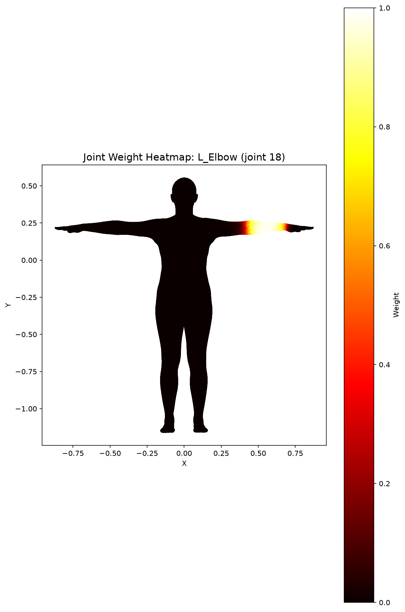
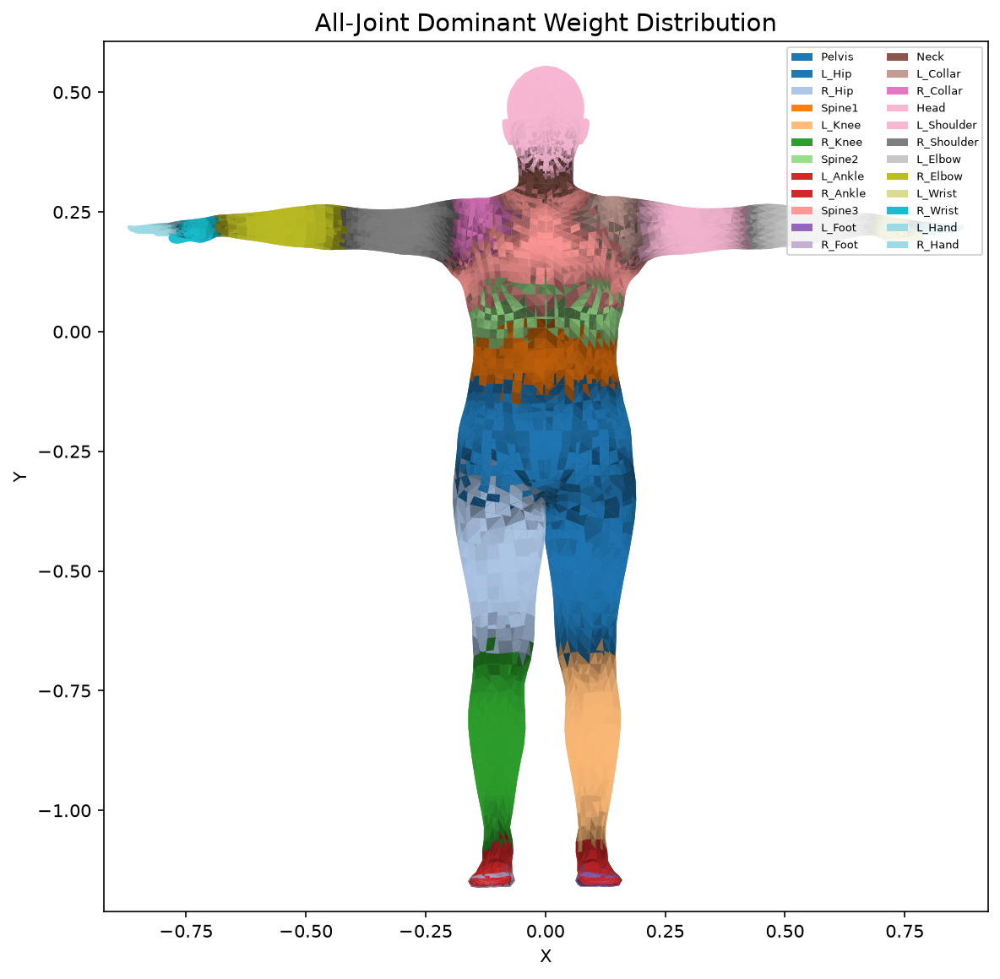
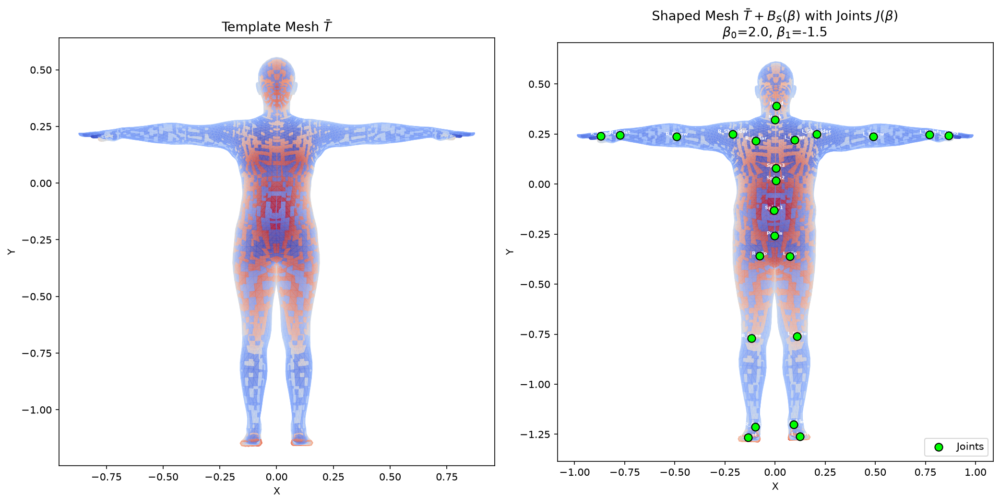
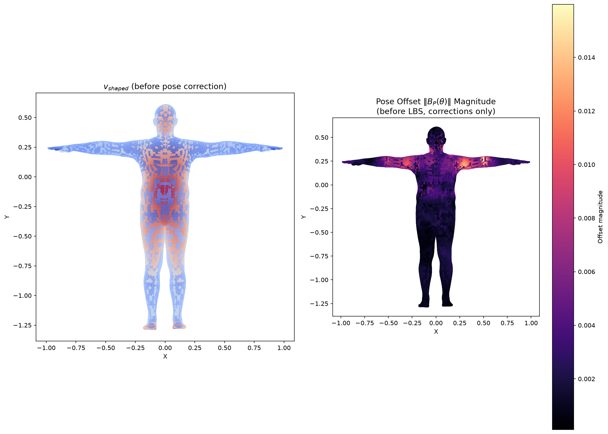
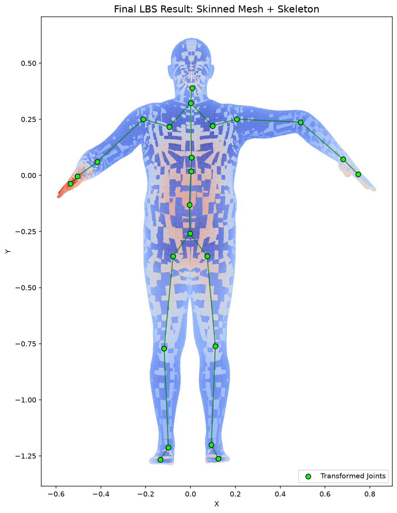
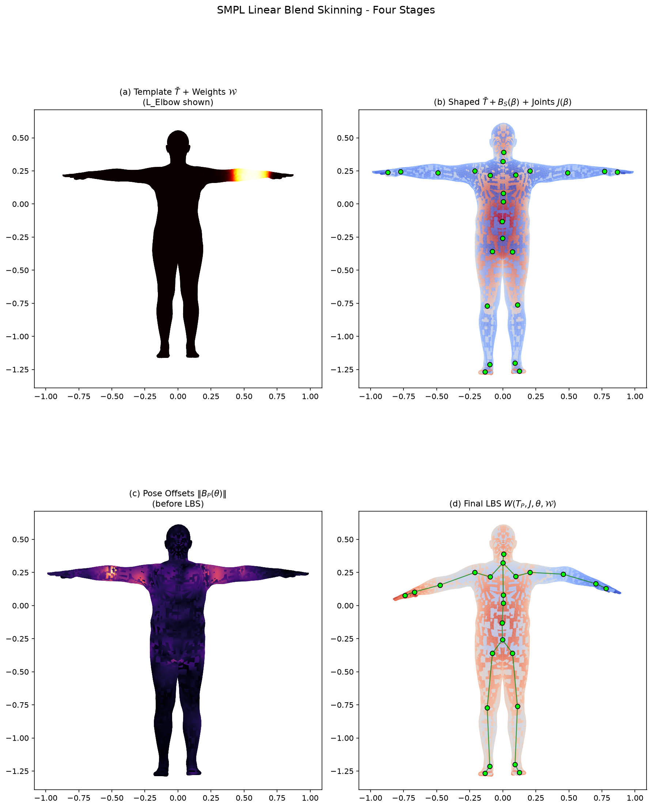
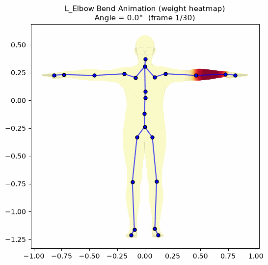

# 实验八：基于 SMPL 模型的 Linear Blend Skinning (LBS) 蒙皮可视化
姓名：王昱彤 学号：202411081029 班级：计算机科学与技术

## 1. 实验目标

本实验基于 SMPL 模型完成一次完整的 LBS (Linear Blend Skinning) 蒙皮过程可视化，理解参数化人体模型中模板网格、形状参数、姿态参数、关节回归器和蒙皮权重之间的关系，并通过手写实现与官方前向传播的对比验证理解的正确性。

## 2. 实验环境

- Python 3.14 / PyTorch 2.12 / smplx 0.1.28
- matplotlib 3.11 / numpy / scipy / imageio

## 3. 模型加载

使用 `smplx.create()` 加载 SMPL 中性模型，获得的基础参数如下：

| 属性 | 值 |
|------|------|
| 顶点数 | 6890 |
| 面片数 | 13776 |
| 关节数 | 24 |
| betas 维度 | 10 |

这些参数定义了 SMPL 的基本规模：6890 个顶点构成 13776 个三角面片的人体网格，由 24 个关节驱动，形状空间为 10 维 PCA 系数。

## 4. LBS 四阶段可视化

### 4.1 阶段 (a)：模板网格与蒙皮权重



初始状态是处于 T-pose 的模板人体网格 $\bar{T}$。此时网格还未根据体型或姿态改变，但每个顶点已经携带了一组对各关节的影响权重 $\mathcal{W}$。上图选取了左肘关节（joint 18, L_Elbow）的权重进行可视化，颜色越亮表示该关节对该顶点的影响越大——权重高度集中在左前臂区域，向肩部和手部方向平滑衰减。



进一步从全局视角观察，每个面片按其"主导影响关节"着色，颜色明暗反映主导权重的强弱。这张图揭示了 SMPL 的一个核心设计：一个顶点通常受多个关节共同影响，而非只归属于某一个关节。这样做的原因在于，关节交界处（如肘部、肩部）如果每个顶点只跟随单一关节，关节边界会产生不连续的"撕裂"。多关节的加权混合使过渡区域能够平滑变形。当然，如果某个顶点的权重几乎全部集中在一个关节上（如前臂中段），它就会像刚体一样完全跟随该关节运动，这在远离交界的区域是恰当的。反之，如果权重分布过于平均，顶点会受多个方向相反的关节拉扯，容易产生"糖果纸"扭曲伪影（candy-wrapper artifact），表现为体积塌缩和不自然的拧绞。

### 4.2 阶段 (b)：形状校正与关节回归



形状参数 $\beta$ 控制人物体型——高矮、胖瘦、肩宽、腿长等。设置 $\beta_0=2.0, \beta_1=-1.5$ 后，模板网格发生了明显的体型变化：

$$v_{shaped} = v_{template} + B_S(\beta)$$

左图为原始模板网格，右图为形状校正后的网格，绿色点标注了通过 J_regressor 回归出的 24 个关节位置。这里有一个关键设计：关节位置不是预设的固定常数，而是从形状变化后的网格中回归得到的。原因很直观——不同体型的人，关节的解剖位置本身就不同。胖的人肩关节比瘦的人更靠外，高的人膝关节更低。如果关节位置固定不变，变胖后的网格和固定的骨骼就会错位，导致蒙皮穿透或浮空。因此 `v_template` 和 `v_shaped` 的本质区别在于：前者是所有人共享的标准模板，后者已经编码了特定个体的体型信息，而关节位置 $J(\beta)$ 随之自适应调整。

### 4.3 阶段 (c)：姿态校正



人体在弯曲时，肩膀、肘部、膝盖附近会出现额外的几何变化——肌肉隆起、皮肤褶皱、关节处的体积维持——这些仅靠骨骼的刚体旋转无法表达。SMPL 在进入真正的 LBS 前，加入了一项 pose blend shape 进行预补偿：

$$T_P(\beta,\theta) = \bar{T} + B_S(\beta) + B_P(\theta)$$

右图的热力图展示了姿态偏移量 $\|B_P(\theta)\|$ 的空间分布。亮色区域集中在我们设置了旋转的关节附近（肘部和肩部），这正是需要非线性补偿的位置。如果去掉这一步直接做 LBS，弯曲处会出现体积塌缩和尖锐折痕，尤其在大角度旋转时表现为"纸片折叠"效果。

需要注意的是，`v_posed` 虽然已包含姿态引起的几何微调，但顶点位置仍在 T-pose 附近——它只是为后续的骨骼旋转做了预补偿，而非最终的姿态结果。`v_shaped` 只反映体型，`v_posed` 在此基础上多了姿态带来的局部修正。

### 4.4 阶段 (d)：最终 LBS 蒙皮



经过前三步准备好关节位置 $J(\beta)$、校正后的顶点 $T_P(\beta,\theta)$ 和蒙皮权重 $\mathcal{W}$ 后，进入真正的线性混合蒙皮：

$$v_i' = \sum_{k=1}^{K} w_{ik} \, G_k(\theta, J(\beta)) \begin{bmatrix} v_i^{posed} \\ 1 \end{bmatrix}$$

每个顶点的最终位置是多个关节全局变换的加权组合。这里的 $J$ 和 $J_{transformed}$ 有本质区别：前者是 T-pose 下从网格回归出的静态关节位置，是运动学链计算的输入；后者是经过前向运动学逐级变换后的关节全局位置，反映了在当前姿态下各关节在世界坐标中的实际位置。图中绿色骨骼连线就是 $J_{transformed}$ 构成的骨骼结构。

之所以最终顶点要写成加权和而非只选择最大权重的关节（即"硬蒙皮"），是因为硬分配会在关节边界产生不连续撕裂。加权混合是 LBS "Linear Blend" 名字的由来，它以简洁的线性运算换取了关节区域的平滑过渡。

### 4.5 四阶段总览



四阶段并排对比清晰展示了 LBS 的递进逻辑：从定义顶点归属（权重），到加入个体体型（形状），到预补偿弯曲变形（姿态校正），最终由骨骼驱动完成蒙皮（LBS）。每一步都在前一步基础上叠加新信息，逐步从静态模板走向具有特定体型和姿态的完整人体。

## 5. 手写 LBS 与官方结果验证

使用相同参数分别运行手写 LBS 实现和官方 `body_model()` 前向传播，逐顶点比较：

| 指标 | 值 |
|------|------|
| Mean Absolute Error | 0.2151318491 |
| Max Absolute Error | 1.2649961710 |

误差来源在于 `batch_rigid_transform` 中 `rel_transforms` 的计算。官方实现通过 `F.pad` 技巧在 4×4 变换矩阵上做减法，只修改平移列同时正确处理齐次坐标行；手写版本直接从平移分量中减去关节偏移，遗漏了第 4 行的对应处理。这一结构性差异沿运动学链逐级传播累积，在末端关节（手、脚）处误差最大，符合误差随链长放大的预期。

## 6. 姿态动画



固定形状参数，让左肘关节从 0° 逐渐弯曲到 -114.6°（-2.0 弧度）再恢复。动画中，红色高权重区域（左前臂）完全跟随肘关节旋转，浅黄色过渡区域受多关节混合影响、运动幅度较小，清晰展示了蒙皮权重如何控制顶点对骨骼运动的响应程度。只有肘关节下游的运动学链（前臂→手腕→手）被带动，上游（肩、躯干）保持不变，体现了层级化运动学结构的作用。

## 7. 项目结构

```
CG-lab8/
├── SMPL_NEUTRAL.pkl
├── smpl/
├── task1_load_smpl.py
├── task2_visualize_weights.py
├── task3_shape_joints.py
├── task4_pose_offsets.py
├── task5_lbs_result.py
├── task6_comparison.py
├── task7_verify_lbs.py
├── task8_animation.py
├── outputs/
│   ├── stage_a_template_weights.png
│   ├── all_joint_weights.png
│   ├── stage_b_shaped_joints.png
│   ├── stage_c_pose_offsets.png
│   ├── stage_d_lbs_result.png
│   ├── comparison_grid.png
│   ├── pose_animation.gif
│   └── summary.txt
└── README.md
```

## 8. 运行方式

```bash
pip install torch smplx numpy scipy matplotlib imageio
python task1_load_smpl.py
python task2_visualize_weights.py
python task3_shape_joints.py
python task4_pose_offsets.py
python task5_lbs_result.py
python task6_comparison.py
python task7_verify_lbs.py
python task8_animation.py
```
